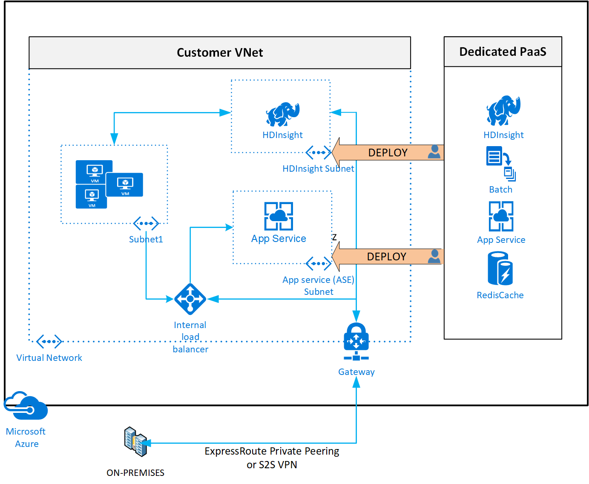
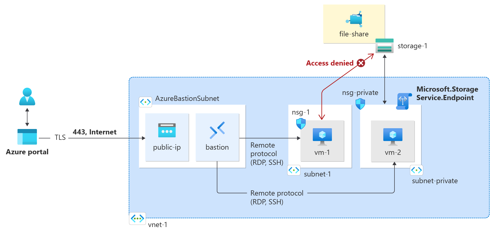

# Terraform Module for Azure VNet and Subnets (CIDRS) Config

Aim of this module is to provide deterministic way of calculating CIDR blocks for VNET Address Spaces, and for subnet CIDR sub-blocks in specific Address Space.

Objective is to avoid overlap of the CIDRs during the updates and development of VNET, ie. adding or removing subnets.

With taken approach, subnet will be allocated a CIDR based on the subnet name (first and last letter) and address space name (first and last letter).

## VNET Introduction

VNET Updates [Azure updates | Microsoft Azure](https://azure.microsoft.com/en-us/updates/?product=virtual-network)


[Virtual network for Azure services](https://learn.microsoft.com/en-us/azure/virtual-network/virtual-network-for-azure-services)

When you deploy dedicated Azure services in a virtual network, you can communicate with the service resources privately, through private IP addresses.



Deploying services within a virtual network provides the following capabilities:

- Resources within the virtual network can communicate with each other privately, through private IP addresses. Example, directly transferring data between HDInsight and SQL Server running on a virtual machine, in the virtual network.

- On-premises resources can access resources in a virtual network using private IP addresses over a [Site-to-Site VPN (VPN Gateway)](https://learn.microsoft.com/en-us/azure/vpn-gateway/design.md?toc=%2fazure%2fvirtual-network%2ftoc.json#s2smulti) or [ExpressRoute](https://learn.microsoft.com/en-us/azure/expressroute/expressroute-introduction.md?toc=%2fazure%2fvirtual-network%2ftoc.json).

- Virtual networks can be [peered](https://learn.microsoft.com/en-us/azure/virtual-network/virtual-network-peering-overview) to enable resources in the virtual networks to communicate with each other, using private IP addresses.

- Service instances are deployed into a subnet in a virtual network. Inbound and outbound network access for the subnet must be opened through [network security groups](https://learn.microsoft.com/en-us/azure/virtual-network/network-security-groups-overview#network-security-groups), per guidance provided by the service.

- Some services impose restrictions on the subnet they're deployed in to. This restriction limits the application of policies, routes or combining VMs and service resources within the same subnet. Check with each service on the specific restrictions as they may change over time. Examples of services are Azure NetApp Files, Dedicated HSM, Azure Container Instances, App Service.

- Optionally, services might require a [delegated subnet](https://learn.microsoft.com/en-us/azure/virtual-network/virtual-network-manage-subnet#add-a-subnet) as an explicit identifier that a subnet can host a particular service. With delegation, services receive explicit permissions to create service-specific resources in the delegated subnet.

- See an example of a REST API response on a [virtual network with a delegated subnet](https://learn.microsoft.com/en-us/rest/api/virtualnetwork/virtualnetworks/get#get-virtual-network-with-a-delegated-subnet). A comprehensive list of services that are using the delegated subnet model can be obtained via the [Available Delegations](https://learn.microsoft.com/en-us/rest/api/virtualnetwork/availabledelegations/list) API.

### Services that can be deployed into a virtual network

|Category|Service| Dedicated<sup>1</sup> Subnet|
|-|-|-|
| Compute | Virtual machines: [Linux](/previous-versions/azure/virtual-machines/linux/infrastructure-example?toc=%2fazure%2fvirtual-network%2ftoc.json) or [Windows](/previous-versions/azure/virtual-machines/windows/infrastructure-example?toc=%2fazure%2fvirtual-network%2ftoc.json) <br/>[Virtual machine scale sets](https://learn.microsoft.com/en-us/azure/virtual-machine-scale-sets/virtual-machine-scale-sets-mvss-existing-vnet.md?toc=%2fazure%2fvirtual-network%2ftoc.json)<br/>[Cloud Service](/previous-versions/azure/reference/jj156091(v=azure.100)): Virtual network (classic) only <br/> [Azure Batch](https://learn.microsoft.com/en-us/azure/batch/nodes-and-pools.md?toc=%2fazure%2fvirtual-network%2ftoc.json#virtual-network-vnet-and-firewall-configuration) <br/> [Azure Baremetal Infrastructure](https://learn.microsoft.com/en-us/azure/baremetal-infrastructure/concepts-baremetal-infrastructure-overview.md?toc=%2fazure%2fvirtual-network%2ftoc.json)| No <br/> No <br/> No <br/> Recommended<sup>2</sup> </br> No |
| Network | [Application Gateway - WAF](https://learn.microsoft.com/en-us/azure/application-gateway/application-gateway-ilb-arm.md?toc=%2fazure%2fvirtual-network%2ftoc.json)<br/>[Azure Bastion](https://learn.microsoft.com/en-us/azure/bastion/bastion-overview.md?toc=%2fazure%2fvirtual-network%2ftoc.json)<br/>[Azure Firewall](https://learn.microsoft.com/en-us/azure/firewall/overview.md?toc=%2fazure%2fvirtual-network%2ftoc.json)  <br/>[Azure Route Server](https://learn.microsoft.com/en-us/azure/route-server/overview.md?toc=%2fazure%2fvirtual-network%2ftoc.json)<br/>[ExpressRoute Gateway](https://learn.microsoft.com/en-us/azure/expressroute/expressroute-about-virtual-network-gateways.md)<br/>[Network Virtual Appliances](/windows-server/networking/sdn/manage/use-network-virtual-appliances-on-a-vn)<br/>[VPN Gateway](https://learn.microsoft.com/en-us/azure/vpn-gateway/vpn-gateway-about-vpngateways.md?toc=%2fazure%2fvirtual-network%2ftoc.json) <br/>[Azure DNS Private Resolver](https://learn.microsoft.com/en-us/azure/dns/dns-private-resolver-overview.md?toc=%2fazure%2fvirtual-network%2ftoc.json) </br> [Virtual Network Data Gateway for Fabric and Power BI](/data-integration/vnet/overview) | Yes <br/> Yes <br/> Yes <br/> Yes <br/> Yes <br/> No <br/> Yes </br> No </br> Yes |
|Data|[RedisCache](https://learn.microsoft.com/en-us/azure/azure-cache-for-redis/cache-how-to-premium-vnet.md?toc=%2fazure%2fvirtual-network%2ftoc.json)<br/>[Azure SQL Managed Instance](https://learn.microsoft.com/en-us/azure/azure-sql/managed-instance/connectivity-architecture-overview?toc=%2fazure%2fvirtual-network%2ftoc.json) </br> [Azure Database for MySQL - Flexible Server](https://learn.microsoft.com/en-us/azure/mysql/flexible-server/concepts-networking-vnet.md) </br> [Azure Database for PostgreSQL - Flexible Server](https://learn.microsoft.com/en-us/azure/postgresql/flexible-server/concepts-networking.md#private-access-vnet-integration)| Yes <br/> Yes <br/> Yes </br> Yes |
|Analytics | [Azure HDInsight](https://learn.microsoft.com/en-us/azure/hdinsight/hdinsight-plan-virtual-network-deployment.md?toc=%2fazure%2fvirtual-network%2ftoc.json)<br/>[Azure Databricks](https://learn.microsoft.com/en-us/azure/databricks/scenarios/what-is-azure-databricks?toc=%2fazure%2fvirtual-network%2ftoc.json) |Recommended<sup>2</sup> <br/> Recommended<sup>2</sup> <br/>
| Identity | [Microsoft Entra Domain Services](https://learn.microsoft.com/en-us/azure/active-directory-domain-services/tutorial-create-instance.md?toc=%2fazure%2fvirtual-network%2ftoc.json) |No <br/>
| Containers | [Azure Kubernetes Service (AKS)](https://learn.microsoft.com/en-us/azure/aks/concepts-network.md?toc=%2fazure%2fvirtual-network%2ftoc.json)<br/>[Azure Container Instance (ACI)](https://www.aka.ms/acivnet)<br/>[Azure Container Service Engine](https://github.com/Azure/acs-engine) with Azure Virtual Network CNI [plug-in](https://github.com/Azure/acs-engine/tree/master/examples/vnet)<br/>[Azure Functions](https://learn.microsoft.com/en-us/azure/azure-functions/functions-networking-options.md#virtual-network-integration) |Recommended<sup>2</sup><br/> Yes <br/> No <br/> Yes
| Web | [API Management](https://learn.microsoft.com/en-us/azure/api-management/api-management-using-with-vnet.md?toc=%2fazure%2fvirtual-network%2ftoc.json)<br/>[Web Apps](https://learn.microsoft.com/en-us/azure/app-service/overview-vnet-integration.md?toc=%2fazure%2fvirtual-network%2ftoc.json)<br/>[App Service Environment](https://learn.microsoft.com/en-us/azure/app-service/overview-vnet-integration.md?toc=%2fazure%2fvirtual-network%2ftoc.json)<br/>[Azure Logic Apps](https://learn.microsoft.com/en-us/azure/logic-apps/connect-virtual-network-vnet-isolated-environment-overview.md?toc=%2fazure%2fvirtual-network%2ftoc.json)<br/>[Azure Container Apps environments](https://learn.microsoft.com/en-us/azure/container-apps/networking.md)<br/>|Yes <br/> Yes <br/> Yes <br/> Yes <br/> Yes
| Hosted | [Azure Dedicated HSM](https://learn.microsoft.com/en-us/azure/dedicated-hsm/index.yml?toc=%2fazure%2fvirtual-network%2ftoc.json)<br/>[Azure NetApp Files](https://learn.microsoft.com/en-us/azure/azure-netapp-files/azure-netapp-files-introduction.md?toc=%2fazure%2fvirtual-network%2ftoc.json)<br/>|Yes <br/> Yes <br/>
| Azure Spring Apps | [Deploy in Azure virtual network (VNet injection)](https://learn.microsoft.com/en-us/azure/spring-apps/enterprise/how-to-deploy-in-azure-virtual-network.md)<br/>| Yes <br/>
| Virtual desktop infrastructure| [Azure Lab Services](https://learn.microsoft.com/en-us/azure/lab-services/how-to-connect-vnet-injection.md)<br/>| Yes <br/>
| DevOps | [Azure Load Testing](https://learn.microsoft.com/en-us/azure/load-testing/concept-azure-load-testing-vnet-injection)<br/>| Yes <br/>

<sup>1</sup> 'Dedicated' implies that only service specific resources can be deployed in this subnet and can't be combined with customer VM/VMSSs <br/>
<sup>2</sup> It's not required but recommended as a best practice to have these services in a dedicated subnet, but not a mandatory requirement imposed by the service.

### Inbound Traffic

#### Private Endpoint

[What is a private endpoint? - Azure Private Link](https://learn.microsoft.com/en-us/azure/private-link/private-endpoint-overview)

A private endpoint is a network interface that uses a private IP address from your virtual network. This network interface connects you privately and securely to a service that's powered by Azure Private Link. By enabling a private endpoint, you're bringing the service into your virtual network.

The service could be an Azure service such as:

* Azure Storage
* Azure Cosmos DB
* Azure SQL Database
* Your own service, using Private Link service.


##### Private-link resource


A private-link resource is the destination target of a specified private endpoint. The following table lists the available resources that support a private endpoint:

| Private-link resource name | Resource type | Sub-resources |
| ---------------------------| ------------- | ------------- |
| Application Gateway | Microsoft.Network/applicationgateways |Frontend IP Configuration name|
| Azure AI services | Microsoft.CognitiveServices/accounts | account |
| Azure API for FHIR (Fast Healthcare Interoperability Resources) | Microsoft.HealthcareApis/services | fhir |
| Azure App Configuration | Microsoft.Appconfiguration/configurationStores | configurationStores |
| Azure App Service | Microsoft.Web/hostingEnvironments | hosting environment |
| Azure App Service | Microsoft.Web/sites | sites |
| Azure Automation | Microsoft.Automation/automationAccounts | Webhook, DSCAndHybridWorker |
| Azure Backup | Microsoft.RecoveryServices/vaults | AzureBackup, AzureSiteRecovery |
| Azure Batch | Microsoft.Batch/batchAccounts | batchAccount, nodeManagement |
| Azure Cache for Redis | Microsoft.Cache/Redis | redisCache |
| Azure Cache for Redis Enterprise | Microsoft.Cache/redisEnterprise | redisEnterprise |
| Azure AI Search | Microsoft.Search/searchServices | searchService |
| Azure Container Registry | Microsoft.ContainerRegistry/registries | registry |
| Azure Cosmos DB | Microsoft.AzureCosmosDB/databaseAccounts | SQL, MongoDB, Cassandra, Gremlin, Table |
| Azure Cosmos DB for PostgreSQL | Microsoft.DBforPostgreSQL/serverGroupsv2 | coordinator |
| Azure Cosmos DB for MongoDB vCore | Microsoft.DocumentDb/mongoClusters | mongoCluster |
| Azure Data Explorer | Microsoft.Kusto/clusters | cluster |
| Azure Data Factory | Microsoft.DataFactory/factories | dataFactory |
| Azure Database for MariaDB | Microsoft.DBforMariaDB/servers | mariadbServer |
| Azure Database for MySQL - Single Server | Microsoft.DBforMySQL/servers | mysqlServer |
| Azure Database for MySQL- Flexible Server | Microsoft.DBforMySQL/flexibleServers | mysqlServer |
| Azure Database for PostgreSQL - Single server | Microsoft.DBforPostgreSQL/servers | postgresqlServer |
| Azure Databricks | Microsoft.Databricks/workspaces | databricks_ui_api, browser_authentication |
| Azure Device Provisioning Service | Microsoft.Devices/provisioningServices | iotDps |
| Azure Digital Twins | Microsoft.DigitalTwins/digitalTwinsInstances | API |
| Azure Event Grid | Microsoft.EventGrid/domains | domain |
| Azure Event Grid | Microsoft.EventGrid/topics  | topic |
| Azure Event Hub | Microsoft.EventHub/namespaces | namespace |
| Azure File Sync | Microsoft.StorageSync/storageSyncServices | File Sync Service |
| Azure HDInsight | Microsoft.HDInsight/clusters | cluster |
| Azure IoT Central | Microsoft.IoTCentral/IoTApps | IoTApps |
| Azure IoT Hub | Microsoft.Devices/IotHubs | iotHub |
| Azure Key Vault | Microsoft.KeyVault/vaults | vault |
| Azure Key Vault HSM (hardware security module) | Microsoft.Keyvault/managedHSMs | HSM |
| Azure Kubernetes Service - Kubernetes API | Microsoft.ContainerService/managedClusters | management |
| Azure Machine Learning | Microsoft.MachineLearningServices/registries | amlregistry |
| Azure Machine Learning | Microsoft.MachineLearningServices/workspaces | amlworkspace |
| Azure Managed Disks | Microsoft.Compute/diskAccesses | managed disk |
| Azure Media Services | Microsoft.Media/mediaservices | keydelivery, liveevent, streamingendpoint |
| Azure Migrate | Microsoft.Migrate/assessmentProjects | project |
| Azure Monitor Private Link Scope | Microsoft.Insights/privatelinkscopes | azuremonitor |
| Azure Relay | Microsoft.Relay/namespaces | namespace |
| Azure Service Bus | Microsoft.ServiceBus/namespaces | namespace |
| Azure SignalR Service | Microsoft.SignalRService/SignalR | signalr |
| Azure SignalR Service | Microsoft.SignalRService/webPubSub | webpubsub |
| Azure SQL Database | Microsoft.Sql/servers | SQL Server (sqlServer) |
| Azure SQL Managed Instance | Microsoft.Sql/managedInstances | managedInstance |
| Azure Static Web Apps | Microsoft.Web/staticSites | staticSites |
| Azure Storage | Microsoft.Storage/storageAccounts | Blob (blob, blob_secondary)<BR> Table (table, table_secondary)<BR> Queue (queue, queue_secondary)<BR> File (file, file_secondary)<BR> Web (web, web_secondary)<BR> Dfs (dfs, dfs_secondary) |
| Azure Synapse | Microsoft.Synapse/privateLinkHubs | web |
| Azure Synapse Analytics | Microsoft.Synapse/workspaces | Sql, SqlOnDemand, Dev |
| Azure Virtual Desktop - host pools | Microsoft.DesktopVirtualization/hostpools | connection |
| Azure Virtual Desktop - workspaces | Microsoft.DesktopVirtualization/workspaces | feed<br />global |
| Device Update for IoT Hub | Microsoft.DeviceUpdate/accounts | DeviceUpdate |
| Microsoft Purview | Microsoft.Purview/accounts | account |
| Microsoft Purview | Microsoft.Purview/accounts | portal |
| Power BI | Microsoft.PowerBI/privateLinkServicesForPowerBI | Power BI |
| Private Link service (your own service) |  Microsoft.Network/privateLinkServices | empty |
| Resource Management Private Links | Microsoft.Authorization/resourceManagementPrivateLinks | ResourceManagement |

> [!NOTE]
> You can create private endpoints only on a General Purpose v2 (GPv2) storage account.

List via AZ CLI for region:

```sh
az network private-endpoint list-types --location westeurope
```

##### Network security of private endpoints

When you use private endpoints, traffic is secured to a private-link resource. The platform validates network connections, allowing only those that reach the specified private-link resource. To access more subresources within the same Azure service, more private endpoints with corresponding targets are required. In the case of Azure Storage, for instance, you would need separate private endpoints to access the *file* and *blob* subresources.

Private endpoints provide a privately accessible IP address for the Azure service, but do not necessarily restrict public network access to it. All other Azure services require additional [access controls](https://learn.microsoft.com/en-us/azure/event-hubs/event-hubs-ip-filtering), however. These controls provide an extra network security layer to your resources, providing protection that helps prevent access to the Azure service associated with the private-link resource.

Private endpoints support network policies. Network policies enable support for Network Security Groups (NSG), User Defined Routes (UDR), and Application Security Groups (ASG). For more information about enabling network policies for a private endpoint, see [Manage network policies for private endpoints](https://learn.microsoft.com/en-us/azure/private-link/disable-private-endpoint-network-policy). To use an ASG with a private endpoint, see [Configure an application security group (ASG) with a private endpoint](https://learn.microsoft.com/en-us/azure/private-link/configure-asg-private-endpoint).

##### Private Link [What is Azure Private Link?](https://learn.microsoft.com/en-us/azure/private-link/private-link-overview?toc=%2Fazure%2Fvirtual-network%2Ftoc.json)


Azure Private Link enables you to access Azure PaaS Services (for example, Azure Storage and SQL Database) and Azure hosted customer-owned/partner services over a private endpoint in your virtual network.

Traffic between your virtual network and the service travels the Microsoft backbone network. Exposing your service to the public internet is no longer necessary. You can create your own private link service in your virtual network and deliver it to your customers. Setup and consumption using Azure Private Link is consistent across Azure PaaS, customer-owned, and shared partner services.

> Azure Private Link is now generally available. Both Private Endpoint and Private Link service (service behind standard load balancer) are generally available. Different Azure PaaS will onboard to Azure Private Link at different schedules. See Private Link availability for an accurate status of Azure PaaS on Private Link. For known limitations, see Private Endpoint and Private Link Service.

##### Private DNS

The DNS settings that you use to connect to a private-link resource are important. Existing Azure services might already have a DNS configuration you can use when you're connecting over a public endpoint. To connect to the same service over private endpoint, separate DNS settings, often configured via private DNS zones, are required. Ensure that your DNS settings are correct when you use the fully qualified domain name (FQDN) for the connection. The settings must resolve to the private IP address of the private endpoint.

The network interface associated with the private endpoint contains the information that's required to configure your DNS. The information includes the FQDN and private IP address for a private-link resource.

For complete, detailed information about recommendations to configure DNS for private endpoints, see [Private endpoint DNS configuration](https://learn.microsoft.com/en-us/azure/private-link/private-endpoint-dns).

##### Subnet Delegation

services might require a [delegated subnet](https://learn.microsoft.com/en-us/azure/virtual-network/virtual-network-manage-subnet#add-a-subnet) as an explicit identifier that a subnet can host a particular service. **With delegation, services receive explicit permissions to create service-specific resources in the delegated subnet.**

See an example of a REST API response on a [virtual network with a delegated subnet](https://learn.microsoft.com/en-us/rest/api/virtualnetwork/virtualnetworks/get#get-virtual-network-with-a-delegated-subnet). A comprehensive list of services that are using the delegated subnet model can be obtained via the [Available Delegations](https://learn.microsoft.com/en-us/rest/api/virtualnetwork/availabledelegations/list) API or AZ CLI:

```sh
az network vnet subnet list-available-delegations --location <LOCATION>
# ie.
az network vnet subnet list-available-delegations --location westeurope

```

#### Service Endpoint (Firewall Rules)

[Azure virtual network service endpoints](https://learn.microsoft.com/en-us/azure/virtual-network/virtual-network-service-endpoints-overview)

Example: [Tutorial: Restrict access to PaaS resources with service endpoints - Azure portal](https://learn.microsoft.com/en-us/azure/virtual-network/tutorial-restrict-network-access-to-resources)

List via AZ CLI in region:

```sh
az network vnet list-endpoint-services -l westeurope
```

Virtual Network (VNet) service endpoint provides secure and direct connectivity to Azure services over an optimized route over the Azure backbone network. Endpoints allow you to secure your critical Azure service resources to only your virtual networks. Service Endpoints enables private IP addresses in the VNet to reach the endpoint of an Azure service without needing a public IP address on the VNet.

> NOTE:  Microsoft recommends use of Azure Private Link and private endpoints for secure and private access to services hosted on the Azure platform. Azure Private Link provisions a network interface into a virtual network of your choosing for Azure services such as Azure Storage or Azure SQL. For more information, see Azure Private Link and What is a private endpoint?.

> NOTE: In practice, sometimes there is a lag when setting up new Private Endpoint, so its good to have a backup in form of Service Endpoint.

Virtual network service endpoints enable you to limit network access to some Azure service resources to a virtual network subnet. You can also remove internet access to the resources. Service endpoints provide direct connection from your virtual network to supported Azure services, allowing you to use your virtual network's private address space to access the Azure services. Traffic destined to Azure resources through service endpoints always stays on the Microsoft Azure backbone network.



Service endpoints are available for the following Azure services and regions. The *Microsoft.\** resource is in parenthesis. Enable this resource from the subnet side while configuring service endpoints for your service:

**Generally available**

https://learn.microsoft.com/en-us/azure/storage/common/storage-network-security?toc=/azure/virtual-network/toc.json#grant-access-from-a-virtual-network

- **[Azure Storage](https://learn.microsoft.com/en-us/azure/storage/common/storage-network-security.md?toc=%2fazure%2fvirtual-network%2ftoc.json#grant-access-from-a-virtual-network)** (*Microsoft.Storage*): Generally available in all Azure regions.
- **[Azure Storage cross-region service endpoints](https://learn.microsoft.com/en-us/azure/storage/common/storage-network-security.md?toc=%2fazure%2fvirtual-network%2ftoc.json#azure-storage-cross-region-service-endpoints)** (*Microsoft.Storage.Global*): Generally available in all Azure regions.
- **[Azure SQL Database](https://learn.microsoft.com/en-us/azure/azure-sql/database/vnet-service-endpoint-rule-overview?toc=%2fazure%2fvirtual-network%2ftoc.json)** (*Microsoft.Sql*): Generally available in all Azure regions.
- **[Azure Synapse Analytics](https://learn.microsoft.com/en-us/azure/azure-sql/database/vnet-service-endpoint-rule-overview?toc=%2fazure%2fvirtual-network%2ftoc.json)** (*Microsoft.Sql*): Generally available in all Azure regions for dedicated SQL pools (formerly SQL DW).
- **[Azure Database for PostgreSQL server](https://learn.microsoft.com/en-us/azure/postgresql/howto-manage-vnet-using-portal.md?toc=%2fazure%2fvirtual-network%2ftoc.json)** (*Microsoft.Sql*): Generally available in Azure regions where database service is available.
- **[Azure Database for MySQL server](https://learn.microsoft.com/en-us/azure/mysql/howto-manage-vnet-using-portal.md?toc=%2fazure%2fvirtual-network%2ftoc.json)** (*Microsoft.Sql*): Generally available in Azure regions where database service is available.
- **[Azure Database for MariaDB](https://learn.microsoft.com/en-us/azure/mariadb/concepts-data-access-security-vnet.md)** (*Microsoft.Sql*): Generally available in Azure regions where database service is available.
- **[Azure Cosmos DB](https://learn.microsoft.com/en-us/azure/cosmos-db/how-to-configure-vnet-service-endpoint.md?toc=%2fazure%2fvirtual-network%2ftoc.json)** (*Microsoft.AzureCosmosDB*): Generally available in all Azure regions.
- **[Azure Key Vault](https://learn.microsoft.com/en-us/azure/key-vault/general/overview-vnet-service-endpoints.md)** (*Microsoft.KeyVault*): Generally available in all Azure regions.
- **[Azure Service Bus](https://learn.microsoft.com/en-us/azure/service-bus-messaging/service-bus-service-endpoints.md?toc=%2fazure%2fvirtual-network%2ftoc.json)** (*Microsoft.ServiceBus*): Generally available in all Azure regions.
- **[Azure Event Hubs](https://learn.microsoft.com/en-us/azure/event-hubs/event-hubs-service-endpoints.md?toc=%2fazure%2fvirtual-network%2ftoc.json)** (*Microsoft.EventHub*): Generally available in all Azure regions.
- **[Azure Data Lake Store Gen 1](https://learn.microsoft.com/en-us/azure/data-lake-store/data-lake-store-network-security.md?toc=%2fazure%2fvirtual-network%2ftoc.json)** (*Microsoft.AzureActiveDirectory*): Generally available in all Azure regions where ADLS Gen1 is available.
- **[Azure App Service](https://learn.microsoft.com/en-us/azure/app-service/app-service-ip-restrictions.md)** (*Microsoft.Web*): Generally available in all Azure regions where App service is available.
- **[Azure Cognitive Services](https://learn.microsoft.com/en-us/azure/ai-services/cognitive-services-virtual-networks.md?tabs=portal)** (*Microsoft.CognitiveServices*): Generally available in all Azure regions where Azure AI services are available.

**Public Preview**

- **[Azure Container Registry](https://learn.microsoft.com/en-us/azure/container-registry/container-registry-vnet.md)** (*Microsoft.ContainerRegistry*): Preview available in limited Azure regions where Azure Container Registry is available.


<!-- BEGIN_TF_DOCS -->


# Terraform IaC


<!-- markdownlint-disable MD033 -->
## Requirements

No requirements.

## Providers

No providers.

## Resources

No resources.

<!-- markdownlint-disable MD013 -->
## Required Inputs

No required inputs.

## Optional Inputs

The following input variables are optional (have default values):

### <a name="input_nmap_path"></a> [nmap\_path](#input\_nmap\_path)

Description: n/a

Type: `any`

Default: `null`

### <a name="input_virtual_network_address_spaces_apex"></a> [virtual\_network\_address\_spaces\_apex](#input\_virtual\_network\_address\_spaces\_apex)

Description: The address <prefix> ie. 10.0.0.0 to use for computing the virtual network address spaces with CIDR /16 per location. Will Changing this forces a new resource to be created. NOTE: it can not overlap to allow peering in between VNETs.

Type: `string`

Default: `"10.0.0.0"`

### <a name="input_virtual_network_subnets_config"></a> [virtual\_network\_subnets\_config](#input\_virtual\_network\_subnets\_config)

Description: n/a

Type: `map`

Default:

```json
{
  "agw": {
    "app": {
      "def": {
        "cidr_bits": 8,
        "natgw": false,
        "policies": null,
        "service_endpoints": [
          "Microsoft.KeyVault"
        ]
      }
    }
  },
  "cog": {
    "oai": {
      "inb": {
        "cidr_bits": 8,
        "policies": null,
        "service_endpoints": []
      },
      "onb": {
        "cidr_bits": 8,
        "policies": null,
        "service_endpoints": [
          "Microsoft.CognitiveServices"
        ]
      }
    }
  },
  "stf": {
    "kv": {
      "inb": {
        "cidr_bits": 8,
        "natgw": false,
        "policies": {
          "private_endpoint_network_policies_enabled": false,
          "private_link_service_network_policies_enabled": false
        },
        "service_endpoints": [
          "Microsoft.KeyVault"
        ]
      }
    },
    "sa/mon": {
      "inb": {
        "cidr_bits": 8,
        "natgw": false,
        "policies": {
          "private_endpoint_network_policies_enabled": false,
          "private_link_service_network_policies_enabled": false
        },
        "service_endpoints": [
          "Microsoft.Storage"
        ]
      }
    },
    "sa/pri": {
      "inb": {
        "cidr_bits": 8,
        "natgw": false,
        "policies": {
          "private_endpoint_network_policies_enabled": false,
          "private_link_service_network_policies_enabled": false
        },
        "service_endpoints": [
          "Microsoft.Storage"
        ]
      }
    }
  }
}
```

## Outputs

The following outputs are exported:

### <a name="output_address_spaces"></a> [address\_spaces](#output\_address\_spaces)

Description: n/a

### <a name="output_address_spaces_all"></a> [address\_spaces\_all](#output\_address\_spaces\_all)

Description: n/a

### <a name="output_subnets_cidrs"></a> [subnets\_cidrs](#output\_subnets\_cidrs)

Description: n/a

### <a name="output_subnets_cidrs_mapping"></a> [subnets\_cidrs\_mapping](#output\_subnets\_cidrs\_mapping)

Description: n/a

### <a name="output_subnets_config"></a> [subnets\_config](#output\_subnets\_config)

Description: n/a

## Modules

The following Modules are called:

### <a name="module_subnets_cidrs"></a> [subnets\_cidrs](#module\_subnets\_cidrs)

Source: ./modules/subnets_cidrs

Version:

### <a name="module_vnet_cidrs"></a> [vnet\_cidrs](#module\_vnet\_cidrs)

Source: ./modules/vnet_cidrs

Version:

<!-- END_TF_DOCS -->